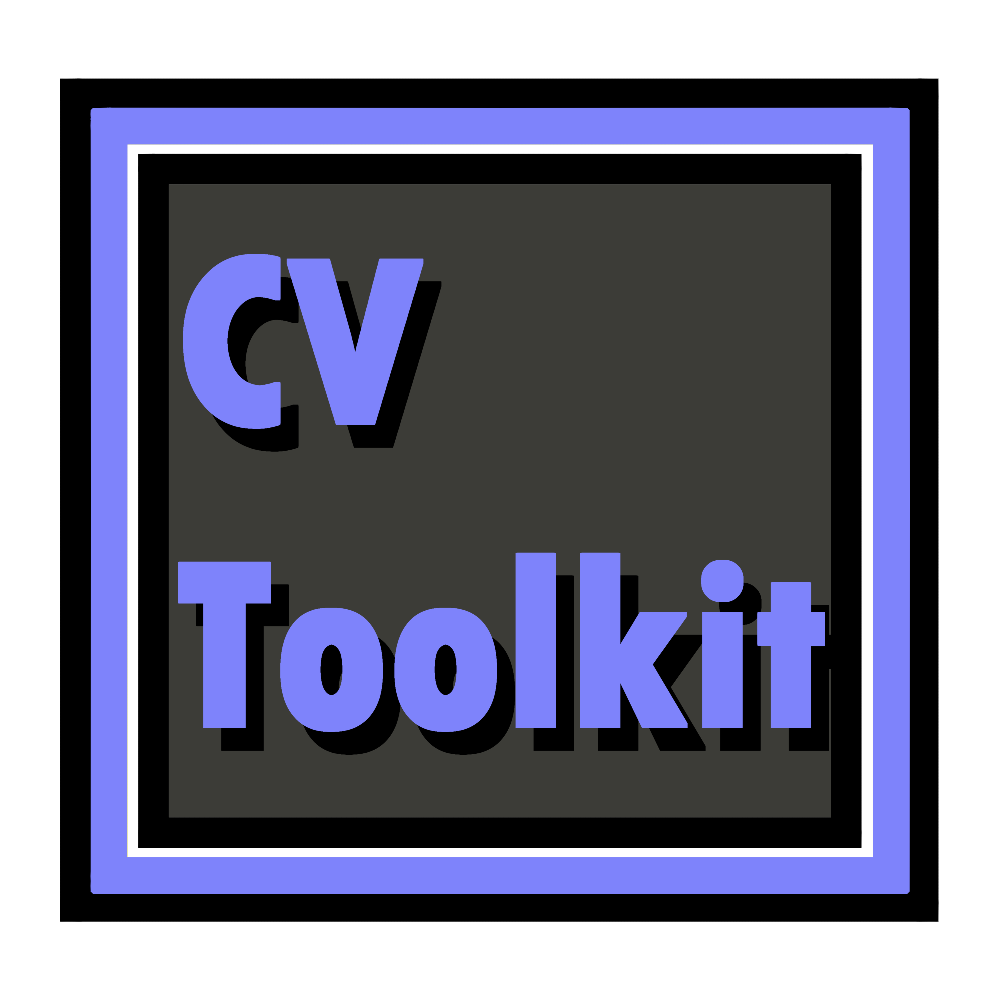

  

# CV ToolKit
CV ToolKit is a Maya tool designed to expedite the creation of custom CV-based controls and modeling landmarks. This is an expanded version of my original landmarkTool project.

Software Used
Autodesk Maya 2025 • Python • PySide6 • Qt Designer

# Why should I use CV Tool Kit?
The goal of this project was to be able to create a full toolkit for riggers, to provide quick access custom artist-friendly CVs, as well as create modeling landmarks that can be stored as under reusable presets.

# Features:
curve manipulation 
user presets 
control coloring 
