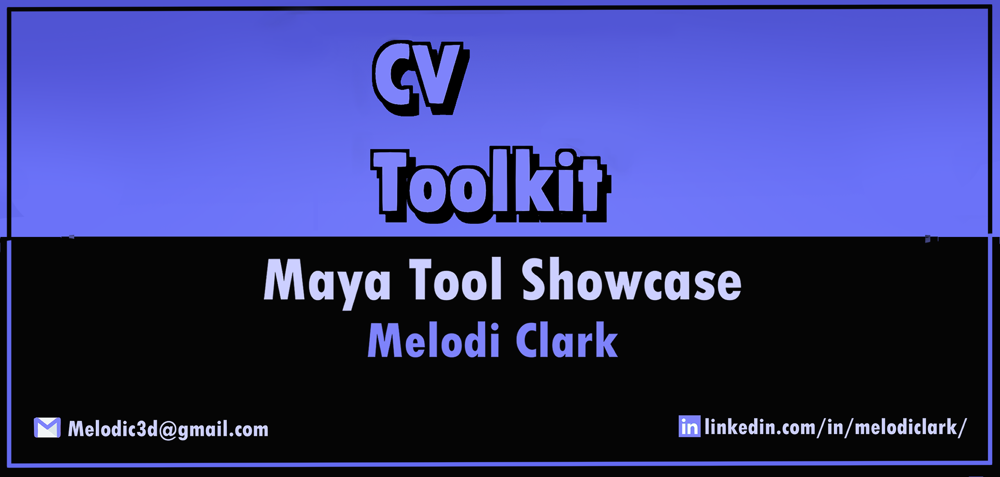
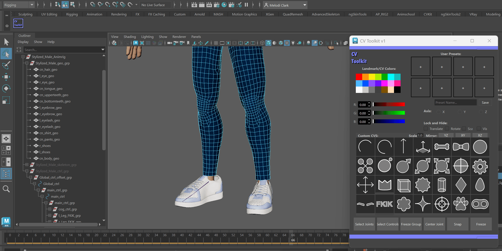
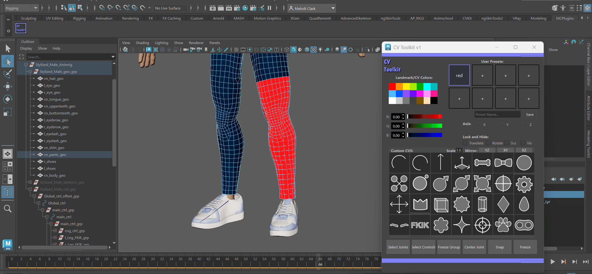
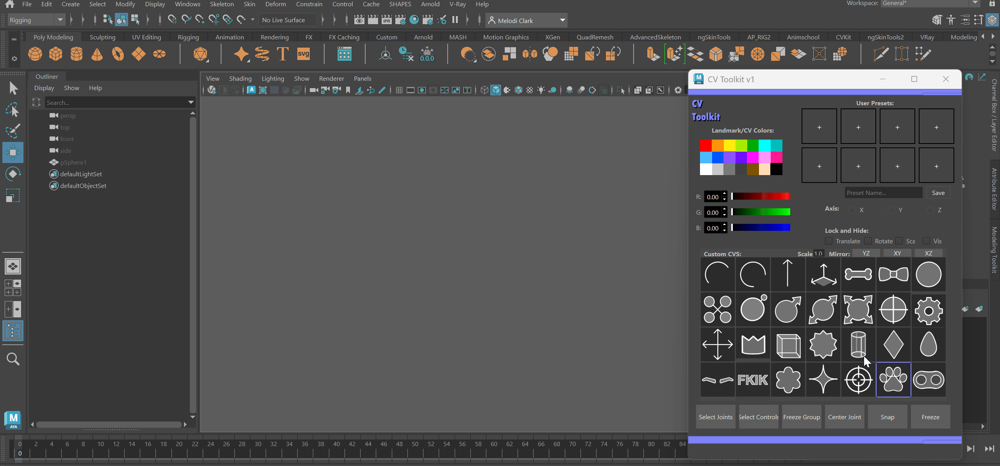

<p align="center">
  
</p>

# CVToolkit
CVToolKit is a Maya tool designed to expedite the creation of custom CV-based controls and modeling landmarks. This is an expanded version of my original landmarkTool project.

# Tool Showcase
<a href="https://vimeo.com/1228323327">
  
</a>

# Software Used
Autodesk Maya 2025 • Python • PySide6 • Qt Designer • Adobe Photoshop

# Goals
Creating and customizing rig controls in Maya can include many repetitive steps: creating curves, changing curve colors, assembling new materials  and recreating commonly used controls between projects.

CV Toolkit was developed as a solution to alleviate the burden of manually maneuvering these tasks into a single artist friendly UI interface.

# Features:
•  Landmark Creation with reusable user presets.

🎥 Watch the Full High-Res Video Walkthrough on Vimeo



•  Object-Specific landmark presets


•  Custom CV control library

•  Curve Manipulation 

•  RGB Presets and Custom RGB sliders

•  Customizable CV colors

•  Joint and curve selection utilities


•  Multi Curve Shape data extraction and reconstruction

# Documentation
## Installation

1. Download the CVToolkit folder.
2. Place the entire `CVToolkit` folder inside your Maya scripts directory:

   `Documents/maya/2025/scripts/`

3. Restart Maya.
4. Open the **Python** tab of Maya's Script Editor.
5. Run:

```python
import CVToolkit as cvt
cvt.openWindow()
```

CVToolkit should now open inside Maya.

You can also add the launch code to a Maya shelf button for quicker access.

# Planned Updates

CVToolkit is still something I would like to continue developing. Some areas I would like to explore in future versions include:

•  More rigging utilities

•  Improved preset management

•  Additional control shapes

•  Better organization of the tool's modules

•  More workflow automation


@ 2026 Melodi Clark
